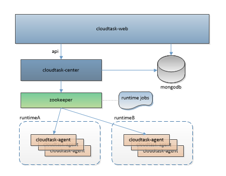

# CloudTask

### What is CloudTask?
`cloudtask` is a distributed task scheduling platform. 

task schedule in a cluster manner responsible for the distribution of tasks and information collection, there is better scalability and contractility.
##### More info at [cloudtask.github.io](https://cloudtask.github.io/cloudtask)

### Architecture

### Features   
* WebUI Supporting
* Tasks Timed Schedule
* Tasks Notify
* Tasks Slice
* Elasticity Cluster
* Cluster Failover 

### Components

* [CloudTask InitConfig](https://github.com/cloudtask/cloudtask-initconfig)
* [CloudTask Web](https://github.com/cloudtask/cloudtask-web)
* [CloudTask Center](https://github.com/cloudtask/cloudtask-center)
* [CloudTask Agent](https://github.com/cloudtask/cloudtask-agent)

## License

cloudtask source code is licensed under the [Apache Licence 2.0](http://www.apache.org/licenses/LICENSE-2.0.html).   
