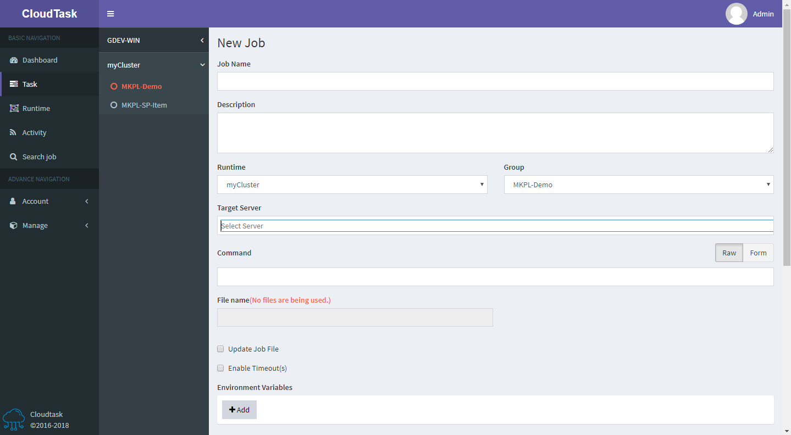

> Add Task

Fill in the form information as shown in the page form

- `Runtime`: Job operating environment
- `Group`: Group information to which the Job belongs. It is used to classify jobs. Group information can be created under the Group module.
- `Target Server`: The server that runs the Job supports drop-down selection and manual input. If it is empty, it means that the server will be randomly allocated under the `Runtime`.
- `Command`: Job's run command (eg node index.js)
- `File name`: Show the current execution program name of the Job, click the delete button behind, you can delete the current Job execution program
- `Update file`: Optional. Select Job's execution program (must be an executable program and compressed in .tar.gz format), or select the history execution program of Job in `Backup List`. After selecting, click the Download button at the back to download the execution program.
- `Enable Timeout(s)`: Optional. Set the expiration time of the job in seconds (s). The expiration time must be in the range from `1s` to `172800s` (2 days)
- `Environment Variables`：Environment variables
- `Send Notification`: Optional. Used for email notification when the job executes `success` or `failure`
- `Schedules`：Schedule of task execution. If multiple schedules are set, the server will calculate the next execution time of each task according to each schedule, and then select the time closest to the current time as the next execution time of the task.
