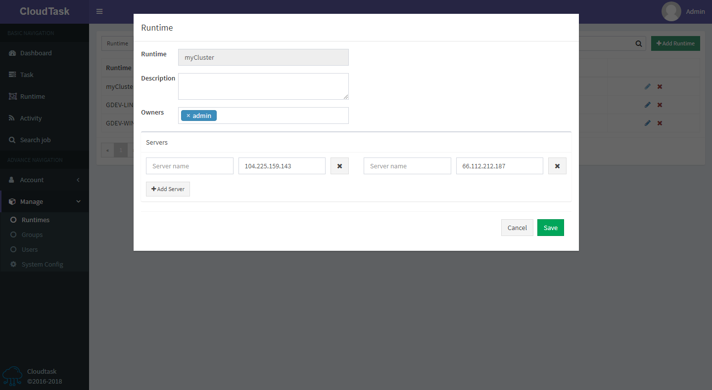

# Edit Runtime

> Description

- Runtime information is consistent with [`adding runtime`](add-runtime.md)

PS: When deleting a `Server`, the current runtime will be allocated in the remaining `Server`
