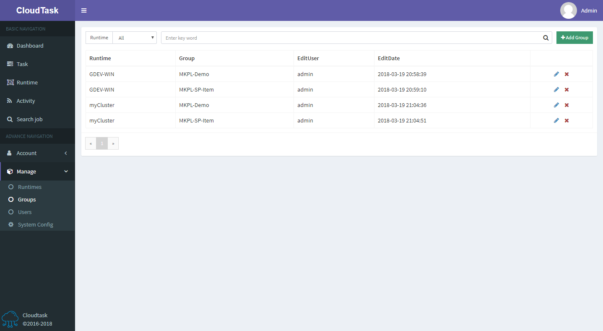

# Group List

> Description

- To add a group, click the `Add Group` button at the top of the page
- The two icons in the last column of the table are `edit group information`, `delete group '
PS: Only admin users can add group
Only the owners of the group or the owners of the runtime which the current group blongs to can `edit group` and `delete group`, and `delete group` will delete all tasks in the current group
