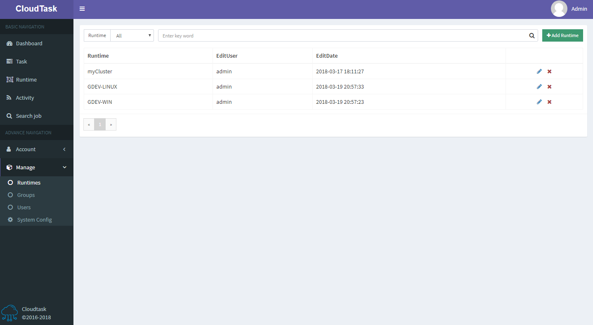

# Runtime List

> Description

- To add a runtime, click the `Add Group` button at the top of the page
- The two icons in the last column of the table are `edit runtime information`, `delete runtime '

> PS: Only admin users can add runtime
    Only the owners of the runtime can `edit runtime` and `delete runtime`, and delete the runtime only if the current runtime does not       include any groups
