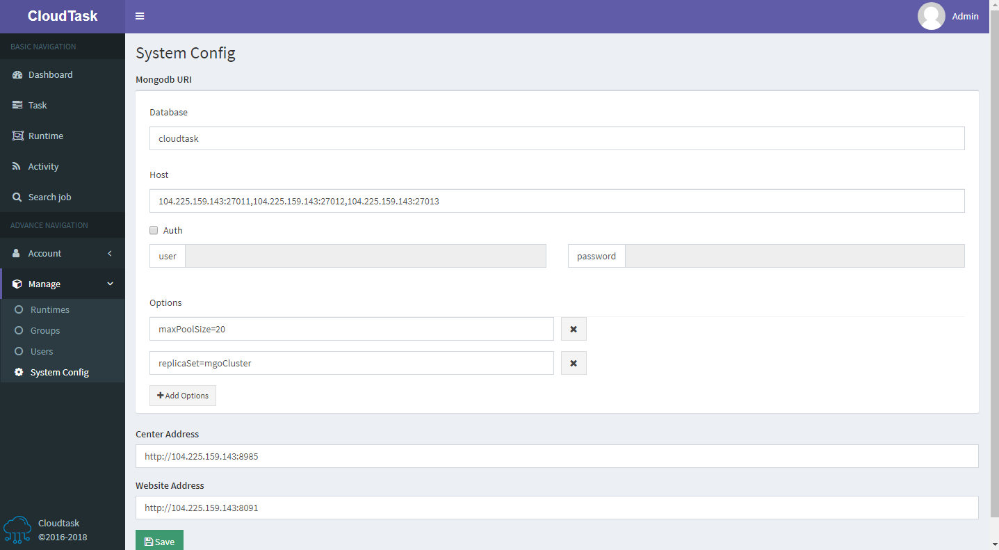

# System Config

> Description

There are three configuration items, `Mongodb URI`, `Center Address` and `Website Address`.
- `Database`: The name of mongodb
- `Host`: The link address of mongodb
- `Auth`: The infomation of auth
- `Options`: The options of moogodb 

- `Center Address`: The IP address of cloudtask center

- `Website Address`: The address of cloudtask website

PS: Currently the database only supports mongodb
