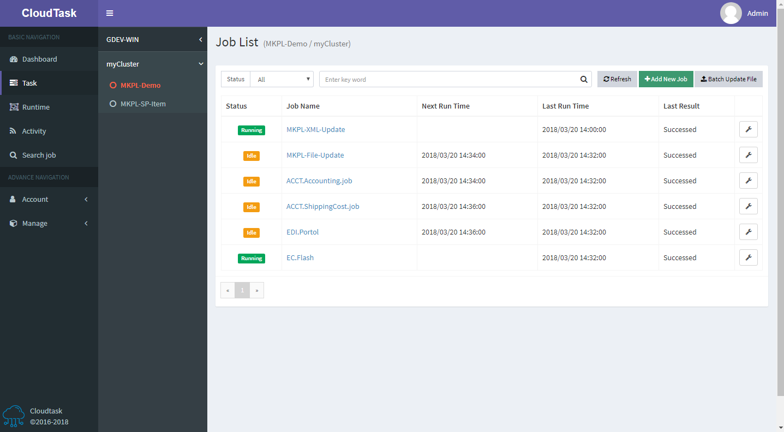
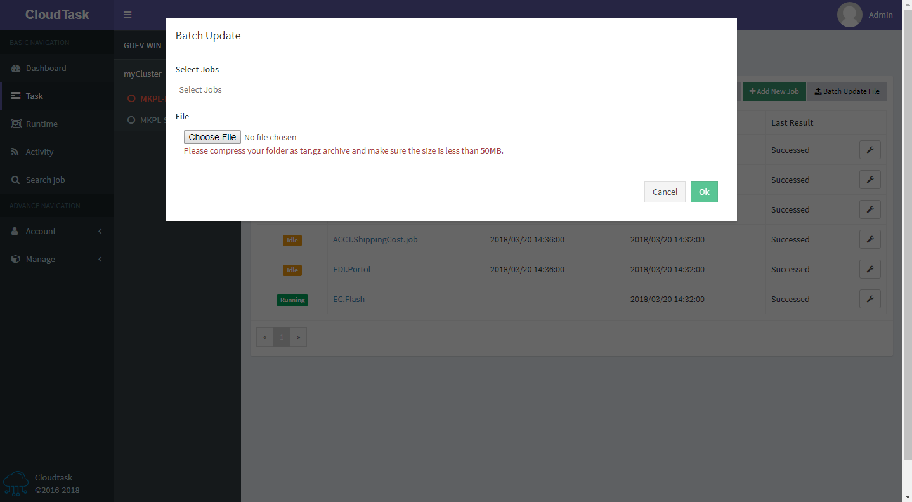

# Task list

> Table header

- `Status`：There are five states `running`, `disabled`, `idle`, `reallocating`, and `failed`, which respectively mean `execute`, `disable`, `wait for execution`, `wait for allocation`, `execute failed`, Ability to filter the corresponding status by selecting status
- `Add New Job`：Click the `Add New Job` button at the top of the page to create a new task
- `Batch Update File`：Batch update the task file under the current group

> Table body

- `Status`: Task status
- `Job Name`: Task name
- `Next Run Time`: The next run time of task
- `Last Run Time`: The last run time of task
- `Last Result`: The last result of task

The last column of the list can operate on tasks:
- `Start`: Force the task to execute once, the task being executed is not available
- `Stop`: Force the task to stop, only the task being executed is available
- `Disabled`：Disable the task, the disabled task will no longer be assigned to execute
- `Enabled`: Enable tasks, enabled tasks will be re-assigned
- `Logs`：View the task log
- `Download File`：Download the current task's execution file, this option is displayed when the current task has an execution file