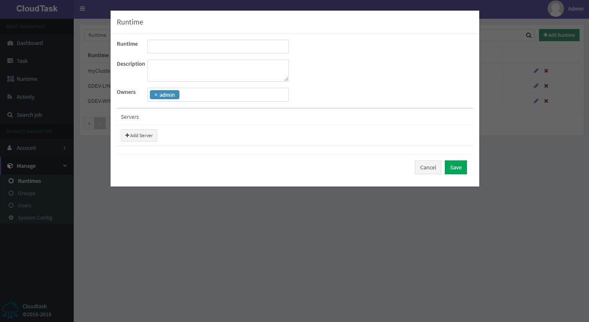

# 新建Runtime

> 描述

- `Runtime`: Runtime名称
- `Description`: Runtime的描述
- `Owners`: Runtime的所有者。如果一个用户是Runtime的所有者，那么这个用户就能编辑或者删除这个Runtime，并且也能操作属于这个Runtime的所有组
- `Servers`: Runtime所在工作节点的服务器地址

PS：整个站点内的Runtime不能重名，否则将新建失败
    `Servers`可在`Name`和`IP`任选一个填写，但填写的`Name`和`IP`不能重复，服务器将优先匹配IP
