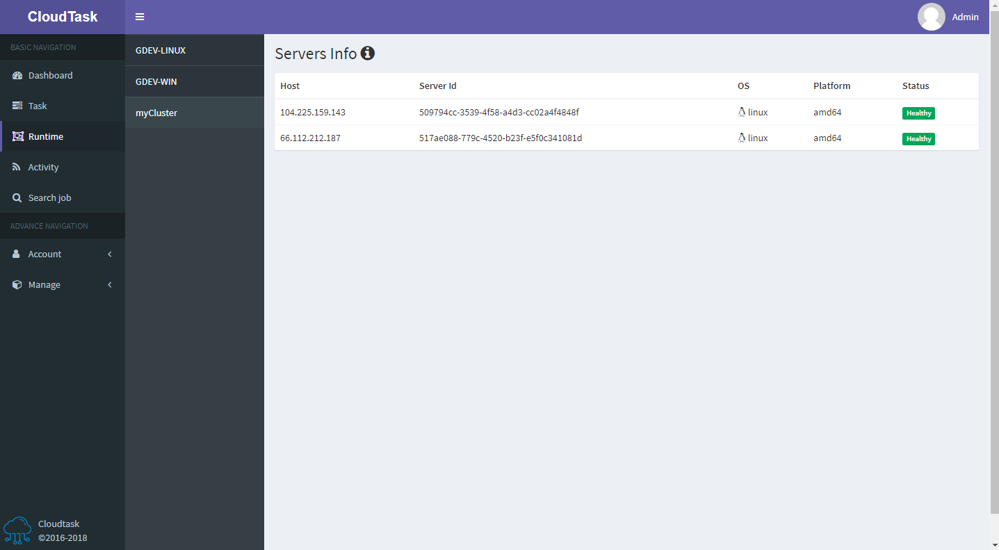
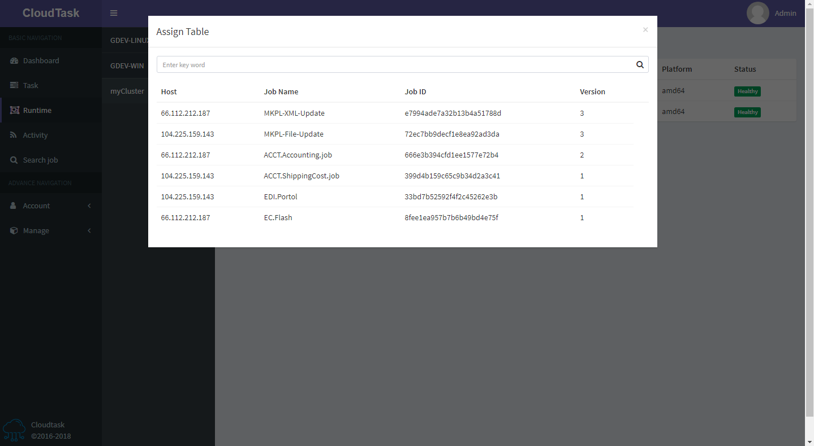

# Runtime状态

>描述

- `Host`：服务器IP地址或服务器名，优先显示IP地址
- `OS`：服务器操作系统
- `Platform`：服务器平台
- `Status`：服务器状态，有`Healthy`和`Disconnected`两种

点击页面顶部的`i`按钮显示当前runtime下的任务分配情况

- `Host`：服务器IP地址或服务器名，优先显示IP地址
- `Job Name`：任务名
- `Job ID`：任务id
- `Version`：版本

